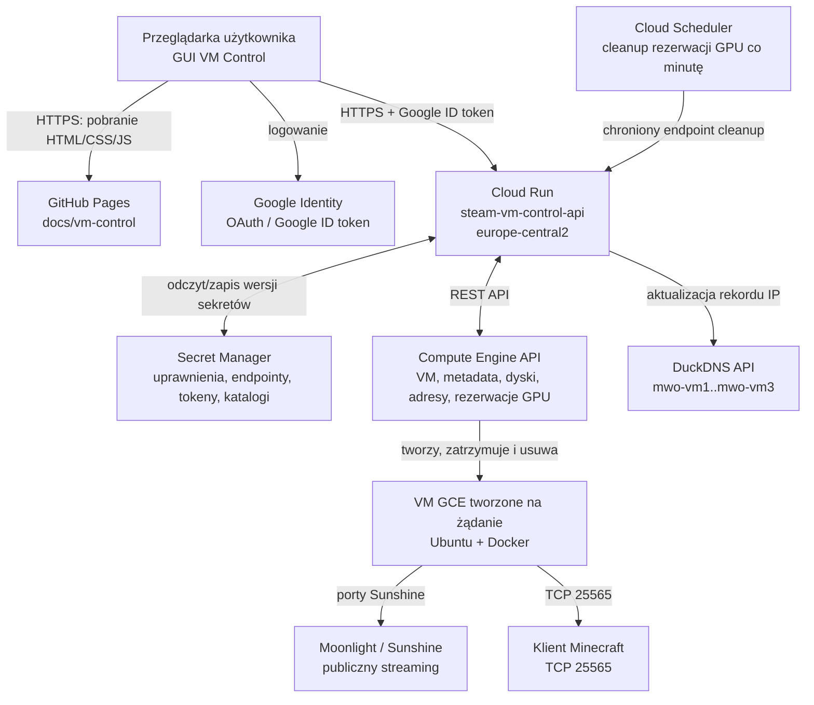
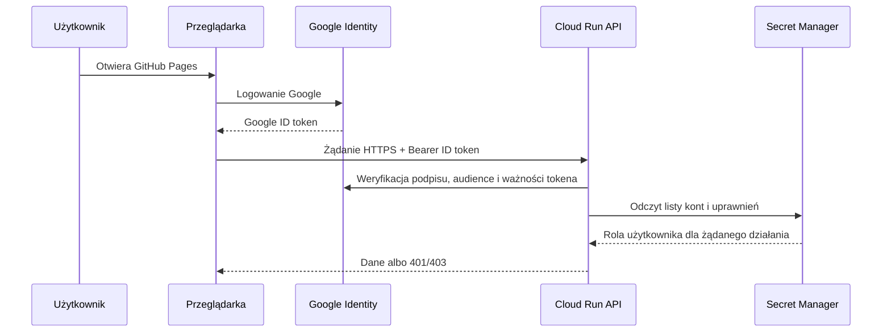
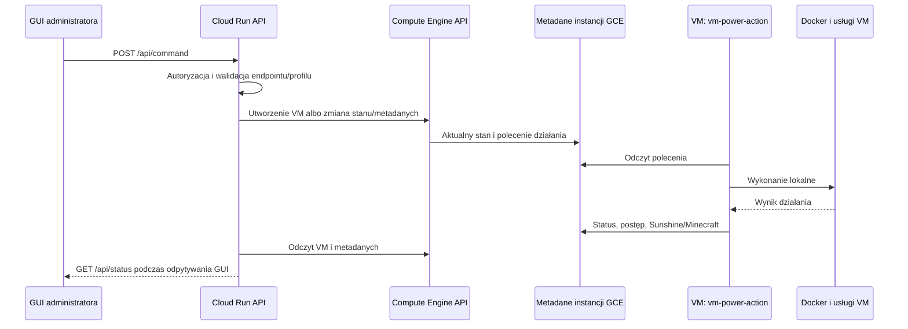
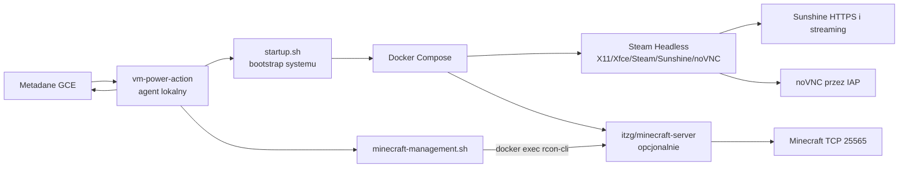

# Architektura bieżącego rozwiązania VM Control

Ten dokument opisuje produkcyjną architekturę forka `docker-steam-headless`:
panel GitHub Pages, API Cloud Run oraz maszyny Compute Engine tworzone na żądanie.
Zastępuje on starszy przepływ GitHub Actions z tokenem PAT opisany w
[Legacy GitHub Pages mode](./github-pages-vm-control.md).

## Stan wdrożenia

Stan poniżej został zweryfikowany 2026-08-21 i należy go traktować jako
operacyjny snapshot, a nie trwałą konfigurację:

- GitHub Pages publikuje statyczny panel z `docs/vm-control/`.
- Cloud Run `steam-vm-control-api` działa w regionie `europe-central2`.
- Cloud Scheduler `steam-vm-control-capacity-cleanup` jest aktywny co minutę.
- Nie ma obecnie zarządzanej instancji GCE, dysku ani snapshotu. W konsekwencji
  Sunshine, noVNC, Steam Headless i Minecraft nie są teraz uruchomione.

Pozostałe usługi Cloud Run w tym samym projekcie, np. `auchan-*`, nie należą
do tego rozwiązania.

## Zasady projektowe

- Przeglądarka nie dostaje klucza GCP, tokena DuckDNS, hasła RCON ani tokena GitHub.
- Wszystkie operacje infrastrukturalne przechodzą przez Cloud Run i konto usługi.
- VM odbiera polecenia z metadanych GCE, nie przez publiczne administracyjne API.
- Jednocześnie może działać tylko jedna zarządzana VM, ponieważ usługi używają
  tych samych publicznych portów.
- noVNC jest dostępne administracyjnie przez IAP, a RCON Minecrafta pozostaje
  wewnątrz VM. Nie są publicznymi usługami zarządzającymi.

## Widok całościowy

## Komponenty stałe

| Komponent | Gdzie działa | Rola | Komunikacja |
| --- | --- | --- | --- |
| GitHub Pages | infrastruktura GitHub | Dostarcza statyczne GUI użytkownika, administratora i Minecraft. | Przeglądarka pobiera pliki HTTPS. GUI wywołuje tylko Cloud Run. |
| Google Identity | usługi Google | Uwierzytelnia użytkownika i wystawia Google ID token. | Token jest przekazywany przez przeglądarkę do API. |
| `steam-vm-control-api` | Cloud Run, `europe-central2` | Autoryzuje żądania, steruje GCE, agreguje statusy, zarządza endpointami, backupami, GPU i Minecraftem. | HTTPS z GUI; Google Compute, Secret Manager i DuckDNS API. |
| Konto usługi `vm-control-api` | Google Cloud IAM | Tożsamość wykonawcza Cloud Run. Ma wymagane role GCE i dostęp do wybranych sekretów. | Używane automatycznie przez Cloud Run. |
| Secret Manager | Google Cloud | Bezpiecznie przechowuje dane sterujące rozwiązaniem. | Tylko Cloud Run odczytuje lub aktualizuje wersje sekretów. |
| Cloud Scheduler | `europe-central2` | Wywołuje czyszczenie wygasłych rezerwacji GPU. | Co minutę wywołuje chroniony endpoint wewnętrzny Cloud Run. |
| DuckDNS | usługa zewnętrzna | Utrzymuje rekordy DNS endpointów. | Cloud Run aktualizuje rekord po zmianie publicznego IP VM. |

## Dane sterujące w Secret Managerze

Wartości sekretów nie są wystawiane do GUI. Najważniejsze z nich to:

| Sekret | Przeznaczenie |
| --- | --- |
| `steam-vm-control-allowed-users` | Lista kont i uprawnień GUI, administracji oraz Minecrafta. |
| `steam-vm-control-endpoints` | Rejestr endpointów `mwo-vm1`, `mwo-vm2`, `mwo-vm3` i ich przypisań. |
| `steam-vm-control-duckdns-token` | Token aktualizacji rekordów DuckDNS. |
| `steam-vm-control-session-token` | Materiał do podpisywania krótkotrwałej sesji GUI. |
| `steam-vm-control-capacity-cleanup-token` | Token wyłącznie dla zadania Scheduler cleanup. |
| `steam-vm-control-migration-targets` | Stan migracji zatrzymanych VM. |
| `steam-vm-control-minecraft-versions` | Ostatni poprawnie pobrany katalog wersji Minecraft. |
| `steam-vm-control-runtime-images` | Katalog obrazów runtime wybieranych przez administratora. |
| `steam-vm-control-compatibility-catalog` | Wyniki testów zgodności GPU i Sunshine. |

## Uwierzytelnienie i autoryzacja

Cloud Run sprawdza podpis, `audience` i ważność tokena Google, a następnie
listę dozwolonych użytkowników. Administratorzy zarządzają użytkownikami,
endpointami, oprogramowaniem i cyklem życia VM. Dostęp do panelu Minecraft
może być przyznany oddzielnie od prawa administratora.

Przeglądarka przechowuje URL API i lokalną historię w `localStorage`, a
krótkotrwałą sesję w `sessionStorage`. Nie przechowuje poświadczeń
infrastruktury.

## Cykl życia VM i komunikacja z agentem

Przykład dla `Create`, `Start`, `Stop`, `Delete`, backupu, instalacji aplikacji
lub Minecrafta:

`vm-power-action` jest agentem uruchomionym na VM. Odczytuje komendy z
metadanych instancji, wykonuje je lokalnie i zapisuje wynik z powrotem do tych
samych metadanych. Dzięki temu Cloud Run i GUI widzą ten sam stan, ale VM nie
musi wystawiać administracyjnego API do Internetu.

`startup.sh` przygotowuje system Ubuntu, Docker, konfigurację Compose i
sterownik GPU, jeśli wybrano profil GPU. Pierwsze uruchomienie GPU może wymagać
instalacji sterownika oraz rebootu; stan GCE `RUNNING` nie oznacza wtedy jeszcze
gotowego Sunshine.

## Wnętrze uruchomionej VM

### Steam Headless i Sunshine

VM uruchamia Docker Compose oparty o `Steam-Headless/docker-steam-headless`.
Domyślny obraz Steam Headless jest pobierany jako `josh5/steam-headless:latest`,
o ile administrator nie wybierze innej wersji runtime.

Stos zapewnia pulpit X11, Steam, Sunshine, obsługę wejścia i noVNC. Sunshine
jest udostępniane pod adresem endpointu DuckDNS na porcie `47990`; wymagane porty
streamingu są obsługiwane przez konfigurację zapory VM. noVNC używa portu `8083`,
ale dostęp administracyjny prowadzi przez tunel IAP, nie przez anonimowy publiczny
panel.

Wybrane przy `Create` aplikacje Steam, PrismLauncher i Google Chrome są
instalowane przez agenta jako Flatpak użytkownika `default`, a następnie dodawane
do listy aplikacji Sunshine. Agent publikuje etap i wynik, np. `completed:3/3`.

### Minecraft

Minecraft działa jako osobny kontener `itzg/minecraft-server` na tej samej VM.
Gra jest dostępna przez `mwo-vmX.duckdns.org:25565`. Dane serwera, światy i
rozszerzenia znajdują się na trwałej przestrzeni VM.

RCON działa tylko lokalnie w kontenerze i nie jest publikowany na porcie `25575`.
Panel Minecraft wysyła żądanie do Cloud Run, agent otrzymuje je przez metadane,
a `minecraft-management.sh` wywołuje `rcon-cli` przez `docker exec`. Tą drogą
obsługiwane są konsola, gracze, whitelisty, operatorzy, restart,
`server.properties` i dodatki Modrinth.

## Sieć i endpointy

System zarządza endpointami `mwo-vm1.duckdns.org`, `mwo-vm2.duckdns.org` i
`mwo-vm3.duckdns.org`. Cloud Run wybiera wolny endpoint podczas tworzenia VM i
po zmianie IP aktualizuje DuckDNS.

- Sunshine: `https://mwo-vmX.duckdns.org:47990/`.
- Minecraft: `mwo-vmX.duckdns.org:25565`.
- noVNC: administracyjnie przez IAP na porcie `8083`.
- RCON: tylko wewnątrz VM/kontenera, bez publicznego portu.

Publiczny IP VM jest zwykle efemeryczny. Administrator może zachować adres
statyczny; w przeciwnym przypadku jest zwalniany po zatrzymaniu lub usunięciu VM.

## GPU, rezerwacje i skanowanie

Skanowanie GPU nie opiera się wyłącznie na katalogu stref. Cloud Run tworzy
krótkotrwałe rezerwacje GCE dla kombinacji GPU/strefa, odczytuje wynik i zwalnia
rezerwację. GUI pokazuje postęp, znalezione kombinacje i umożliwia pauzę,
wznowienie lub anulowanie wraz ze zwolnieniem rezerwacji.

Rezerwacje mają TTL 300 sekund. Cloud Scheduler dodatkowo co minutę wywołuje
chroniony endpoint cleanup, który usuwa wygasłe rezerwacje nawet po zamknięciu
przeglądarki lub przerwaniu skanu.

## Dane trwałe, backup i migracja

Architektura obsługuje dysk startowy, dysk stanu, dane gier/Minecrafta, backupy
i opcjonalne archiwum w Google Drive. Backup jest wykonywany z działającej VM.

Migracja dotyczy tylko VM w stanie `TERMINATED`: wykorzystuje tymczasowy
snapshot, tworzy docelowe dyski i VM w nowej strefie, a następnie usuwa snapshot
zarówno po sukcesie, jak i błędzie. Tryb `copy` zachowuje źródło, a `move`
usuwa je po udanym przeniesieniu.

## Powiązane dokumenty

- [Cloud Run VM Control](./cloud-run-vm-control.md): wdrożenie API i konfiguracja Google Cloud.
- [Minecraft management](./minecraft-management.md): szczegóły RCON, runtime i Modrinth.
- [Troubleshooting](./troubleshooting.md): diagnostyka sieci, Sunshine i GUI.
- [Legacy GitHub Pages mode](./github-pages-vm-control.md): nieużywany przepływ PAT/GitHub Actions.
