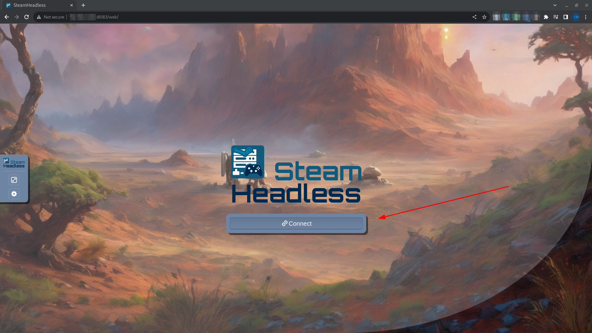

# Tworzenie Dockera

Postępuj zgodnie z poniższymi instrukcjami, aby skonfigurować plik docker-compose.yml dla swojego systemu.

> __Uwaga__
>
> W tych instrukcjach założono, że w systemie zainstalowano programy docker i docker-compose.
> 
> W zależności od tego, jak to zainstalowałeś, polecenia umożliwiające wykonanie docker compose mogą się różnić.


## PRZYGOTUJ KATALOGI:

> __Ostrzeżenie__
>
> Te polecenia należy uruchamiać jako użytkownik. Nie uruchamiaj ich jako root.
> 
> Jeśli uruchomisz te polecenia jako root, może być konieczne ręczne naprawienie uprawnień i własności.

Utwórz katalog dla swojej usługi:
```shell
sudo mkdir -p /opt/container-services/steam-headless
sudo chown -R $(id -u):$(id -g) /opt/container-services/steam-headless
```

Utwórz katalog dla danych konfiguracyjnych usługi:
```shell
sudo mkdir -p /opt/container-data/steam-headless/{home,.X11-unix,pulse}
sudo chown -R $(id -u):$(id -g) /opt/container-data/steam-headless
```

(Opcjonalnie) Utwórz katalog dla miejsca instalacji gry:
```shell
sudo mkdir /mnt/games
sudo chmod -R 777 /mnt/games
sudo chown -R $(id -u):$(id -g) /mnt/games
```

Utwórz plik Steam Headless `/opt/container-services/steam-headless/docker-compose.yml`.

Wypełnij ten plik zawartością domyślnego pliku tworzenia platformy Docker

### AMD/Intel:
- [AMD and Intel GPUs](./compose-files/docker-compose.amd+intel.yml).
- [Privileged AMD and Intel GPUs Docker Compose Template](./compose-files/docker-compose.amd+intel.privileged.yml) (zapewnia pełny dostęp do urządzeń hosta).

#### Wiele procesorów graficznych AMD lub Intel

Jeśli masz wiele procesorów graficznych AMD lub Intel i chcesz je odizolować, wykonaj poniższe kroki, aby określić kartę do przejścia w pliku tworzenia okna dokowanego. Wymaga to, aby nie używać uprzywilejowanego szablonu tworzenia wiadomości.
1) Wymień urządzenia PCI i uzyskaj ich identyfikatory `lspci | grep -E 'VGA|3D'`
```
00:02.0 VGA compatible controller: Intel Corporation TigerLake-LP GT2 [Iris Xe Graphics] (rev 01)
06:00.0 VGA compatible controller: Advanced Micro Devices, Inc. [AMD/ATI] Cezanne [Radeon Vega Series / Radeon Vega Mobile Series] (rev c6)
```
W tym przykładzie procesor graficzny Intel ma identyfikator `00:02.0`, a procesor graficzny AMD ma identyfikator `06:00.0`.

2) Dowiedz się, które `/dev/dri/card*` i `/dev/dri/renderD12*` odwołują się do procesora graficznego Intel `00:02.0` (lub dowolnego innego procesora graficznego). Aby to zrobić, uruchom polecenia `ls -la /sys/class/drm/card*` i `ls -l /sys/class/drm/renderD*`.
```
lrwxrwxrwx. 1 root root 0 May  8 15:44 /sys/class/drm/card1 -> ../../devices/pci0000:00/0000:00:02.0/drm/card1
lrwxrwxrwx. 1 root root 0 May  8 15:44 /sys/class/drm/card1-DP-1 -> ../../devices/pci0000:00/0000:00:02.0/drm/card1/card1-DP-1
lrwxrwxrwx. 1 root root 0 May  8 15:44 /sys/class/drm/card1-DP-2 -> ../../devices/pci0000:00/0000:00:02.0/drm/card1/card1-DP-2
lrwxrwxrwx. 1 root root 0 May  8 15:44 /sys/class/drm/card1-DP-3 -> ../../devices/pci0000:00/0000:00:02.0/drm/card1/card1-DP-3
lrwxrwxrwx. 1 root root 0 May  8 15:44 /sys/class/drm/card1-DP-4 -> ../../devices/pci0000:00/0000:00:02.0/drm/card1/card1-DP-4
```
```
lrwxrwxrwx. 1 root root 0 May  8 15:44 /sys/class/drm/renderD128 -> ../../devices/pci0000:00/0000:00:02.0/drm/renderD128
lrwxrwxrwx. 1 root root 0 May  8 15:44 /sys/class/drm/renderD129 -> ../../devices/pci0000:00/0000:06:00.0/drm/renderD129
```

Z tego przykładowego wyniku widzimy, że procesor graficzny Intel to `/dev/dri/card1` i `/dev/dri/renderD128`.

### NVIDIA:
- [NVIDIA GPUs Docker Compose Template](./compose-files/docker-compose.nvidia.yml).
- [Privileged NVIDIA GPUs Docker Compose Template](./compose-files/docker-compose.nvidia.yml) (zapewnia pełny dostęp do urządzeń hosta).

## KONFIGURUJ ŚRODOWISKO:

Utwórz plik Steam Headless `/opt/container-services/steam-headless/.env`, kopiując ten przykład [Environment File](./compose-files/.env.example).

Trzymaj prawdziwe hasła tylko w lokalnym pliku `.env` i nie udostępniaj tego pliku w git.

Edytuj te zmienne według potrzeb.

## WYKONAĆ:

Przejdź do lokalizacji tworzenia i wykonaj ją.
```shell
cd /opt/container-services/steam-headless
sudo docker-compose up -d --force-recreate
```

Po pomyślnym wykonaniu kontenera przejdź do adresu URL hosta dokowanego w przeglądarce na porcie 8083 i kliknij Połącz.
`http://<host-ip>:8083/`


## Rozwiązywanie problemów
[Troubleshooting Docs](./troubleshooting.md)
