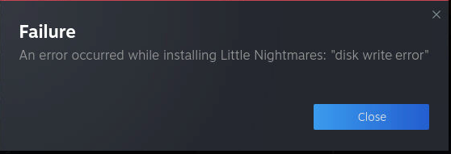

## Flatpaki nie opublikowano

Steam działa z Flatpakiem. Te pakiety Flatpak są zainstalowane w katalogu stworzonym przez użytkownika `default`, dzięki czemu pozostają zachowane pomiędzy aktualizacjami kontenera. Czasami Flatpaki mogą wpaść pomiędzy aktualizacjami Steam Headless. W takich przypadkach może wystąpić brak zabezpieczenia. Aby to zrobić, po prostu usunąć środowisko wykonawcze Flatpak z katalogu domowego użytkownika `default` i zrestartuj kontener.

1) Zatrzymaj pojemnik.
2) Usuń katalog `<SteamHeadless Home>/.local/share/flatpak`
3) Utwórz ponownie kontener. Nie uruchamiaj go ponownie. Spowoduje to konieczność stosowania urządzeń elektrycznych Flatpak w katalogu domowym.
4) Zainstaluj ponownie wszystkie brakujące pakiety Flatpak z aplikacji.

Po aktualizacji Flatpak wszystko powinno zostać usunięte, a każda aplikacja jest niezależna.

## Wystąpił błąd podczas instalacji <gry>: „błąd zapisu na dysku”



1) Zatrzymaj pojemnik
2) Sprawdź, czy zamontowany wolumen /mnt/games jest określone przez UID/GID i czy ustawiono własność 777.
3) Sprawdź, czy katalog `steamapps` istnieje w lokalizacji biblioteki.

> __Uwaga__
>
> Katalog w poleceniach do lokalizacji bibliotek /mnt/games instalowane przy pierwszym uruchomieniu tego kontenera.
> 
> W zależności od sposobu działania, które może zostać podjęte.

```shell
sudo mkdir /mnt/games/GameLibrary/SteamLibrary/steamapps
sudo chmod -R 777 /mnt/games
sudo chown -R $(id -u):$(id -g) /mnt/games
```
