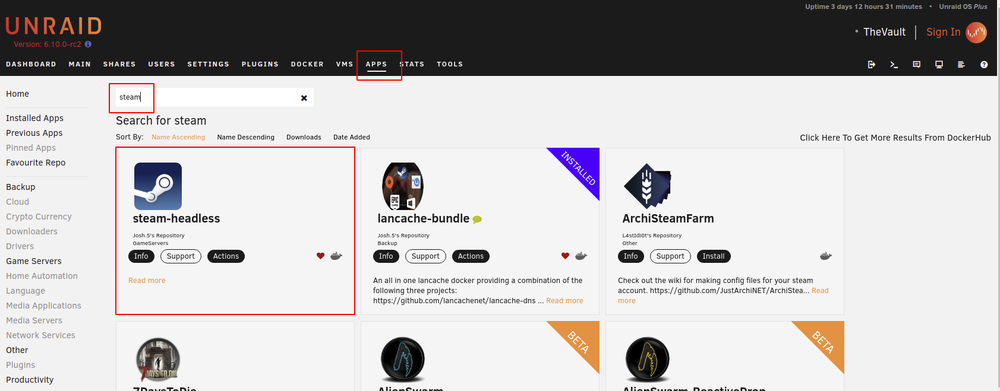
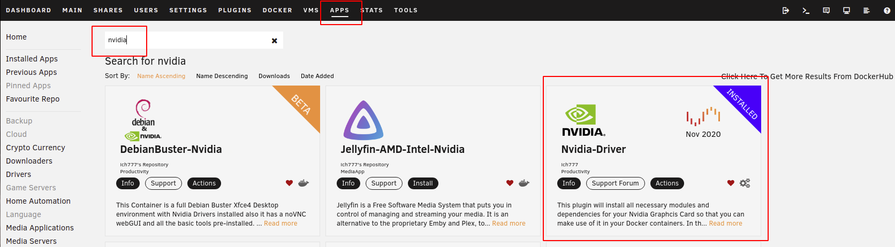
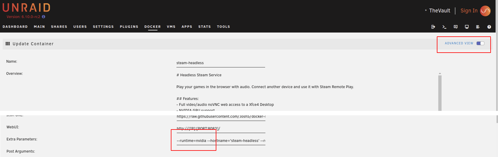
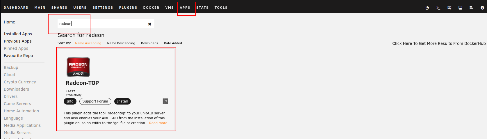
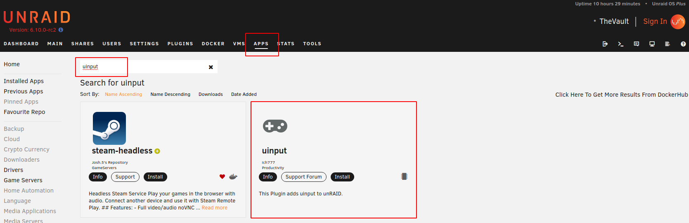
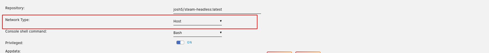

# Unraid

Postępuj zgodnie z tymi instrukcjami, aby sprawdzić Steam Headless na Unraid

## SZABLOŃ KONTENERA:

1. Przejdź do zakładek „**APLIKACJE**”.
2. Wyszukaj „*bezgłowy Steam*”
3. Z wyników wyszukiwania wybierz opcję **Zainstaluj** lub **Działania > Wykonaj**.

4. Skonfiguruj szablon zgodnie z wymaganiami.

## KONFIGURACJA GPU:

Ten kontener może być dostępny z dedykowanym wyposażeniem graficznym.
Aby to zrobić, musisz mieć zainstalowaną wtyczkę Nvidia-Driver lub Radeon-Top.

### NVIDIA

1. Zainstaluj moduł [Nvidia-Driver Plugin](https://forums.unraid.net/topic/98978-plugin-nvidia-driver/) firmy [ich777](https://forums.unraid.net/profile/72388-ich777/). Spowoduje to utrzymanie aktualnej instalacji sterownika NVIDIA na urządzeniu Unraid.

2. przełącznik bezobsługowego edytora szablonów Docker Container na Steam na „**Widok zaawansowany**”.
3. zastosowanie się, że w polu „**Dodatkowe parametry**” dodano parametr „--runtime=nvidia”.

4. (Opcjonalnie — ten krok jest konieczny tylko w przypadku wielu procesorów graficznych NVIDIA. Jeśli masz określony procesor, to odpadnie to jako „wszystko” jest w porządku.) Rozwiń sekcję **Pokaż więcej rozwiązań...** w zastosowaniu części szablonu. W zmiennej **Nvidia GPU UUID**: (NVIDIA_VISIBLE_DEVICES) skopiuj identyfikator UUID szczegółowego wykresu (można go znaleźć we wtyczce Unraid Nvidia. Szczegóły znajdziesz w tym dokumencie na forum).

### AMD

1. Zainstaluj moduł [Radeon-Top Plugin](https://forums.unraid.net/topic/92865-support-ich777-amd-vendor-reset-coraltpu-hpsahba/) firmy [ich777](https://forums.unraid.net/profile/72388-ich777/).

2. Zysk

## DODAWANIE OBSŁUGI KONTROLERA:

Jądro Linux Unraid urządzenia nie wymagające obsługi wejścia kontrolera. Steam wymaga tych urządzeń, aby możliwe było wirtualne urządzenie „emulacja gamepada odprowadzago Steam”, które może następnie zostać przypisane.

[ich777](https://forums.unraid.net/profile/72388-ich777/) uprzejmie zaoferował zbudowanie i utrzymanie wymaganych zastosowań dla jądra Unraid, ponieważ ma już gotowy potok CI/CD i obejmuje inne jednostki napędowe, które są wykorzystywane do innych zastosowań. wielkie dzięki mu za to!

> __Uwaga__
>
> Może to nie być już wymagane w wersji Unraid v6.11 (do wydania). Wymagany moduł wejściowy powinien zostać dodany do jądra dla tej wersji.

1. Instalacja wtyczki **uinput** z zakładkami **Aplikacje**.

2. Kontener nie będzie mógł odebrać zdarzenia jądra od hosta, chyba **Typ sieci:** jest podłączony na „*host*”. może się zdarzyć, że kontener jest skonfigurowany w dziesięć sposobów.

    > __Warning__
    >
    > Be aware that, by default, this container requires at least 8083 available for the WebUI to work. It will also require any ports that Steam requires for Steam Remote Play.

    You can override the default ports used by the container with these variables:
    - PORT_NOVNC_WEB (Default: 8083)
    - WEB_UI_MODE (Default: 'vnc' - Set to 'none' to disable the WebUI)

3. Nie jest wymagane uruchomienie serwera. efekt się, że **steam-headless** kontener Docker został odtworzony po zainstalowaniu wtyczki **uinput**, aby móc zainstalować nowo dodany moduł.
